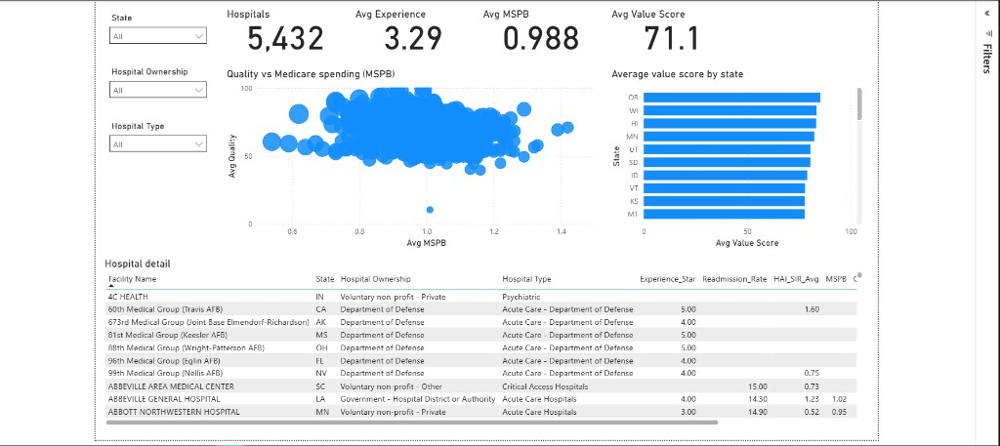

# Medicare Hospital Value Scorecard

Hospital-level look at patient experience and quality versus Medicare spending (MSPB). Built to answer a simple question: which hospitals look stronger on value, and where should a payer or health system dig in first?

Data comes from the free CMS Provider Data Catalog (Hospitals).

## Dashboard



**Live interactive view:** [Open the dashboard](https://srimannarayana-ai.github.io/Medicare-Hospital-Value-Scorecard/live-dashboard/)

> Power BI Service publish needs a Power BI Pro/Premium account from Power BI Desktop (`File → Publish`). If you publish later, replace the live link above with your workspace report URL.

Open the desktop file locally:

`03_outputs/Medicare_Hospital_Value_Scorecard.pbix`

Pages:
- **Scorecard** – filters (state, ownership, hospital type), KPI cards, quality vs MSPB scatter, state bars, hospital table
- **Focus list** – 469 hospitals to review first

Quick totals on Scorecard (unfiltered): about 5,432 hospitals in the roster, ~2,338 with a value score, avg experience ~3.29, avg MSPB ~0.99, avg value ~71.

Focus list breaks down as:
- 51 high spend / low experience (MSPB > 1.10 and experience ≤ 2 stars)
- 418 low value (bottom 20% of value scores)

## Folder layout

```
Medicare Hospital Value Scorecard/
├── 01_raw/                 CMS downloads (see 01_raw/README.md)
├── 02_clean/               cleaned hospital table
├── 03_outputs/             Power BI file + summary CSVs
│   └── PowerBI/
│       └── Scorecard_Data.xlsx
├── docs/
│   ├── images/scorecard_dashboard.png
│   └── live-dashboard/     GitHub Pages interactive view
├── scripts/
├── requirements.txt
└── README.md
```

Raw CMS CSVs are not in this repo (HCAHPS alone is ~100MB). Download steps are in `01_raw/README.md`. Cleaned tables and the Power BI file are included.

## How the value score works

Short version: normalize experience / readmission / infections to 0–100, average them into Quality, then divide by MSPB.

Full write-up: `docs/value_formula.txt`

## Rebuild the data (optional)

```bash
pip install -r requirements.txt
python scripts/build_scorecard.py
python scripts/build_live_dashboard.py
```

Then open the `.pbix` and hit **Refresh**.

Keep `03_outputs/PowerBI/Scorecard_Data.xlsx` where it is — that path is what the Power BI file uses.

## Sharing

Send both files together:
1. `03_outputs/Medicare_Hospital_Value_Scorecard.pbix`
2. `03_outputs/PowerBI/Scorecard_Data.xlsx`

Or share the live link above for a quick browser view.

## Notes worth knowing

- Not every hospital has MSPB. Those stay in the roster but do not get a value score.
- Clicking a row or chart point in Power BI filters the other visuals. Click the same spot again (or empty canvas) to clear it.
- This is a project score for analysis / portfolio use, not an official CMS measure.

## Docs

| File | What it covers |
|------|----------------|
| `docs/scope.txt` | KPIs, grain, periods |
| `docs/data_dictionary.txt` | Field definitions |
| `docs/value_formula.txt` | Score math |
| `docs/images/scorecard_dashboard.png` | Scorecard screenshot |
| `docs/live-dashboard/` | Browser dashboard (GitHub Pages) |
| `docs/00_scope.xlsx` | Early scope sheet |
| `docs/01_Dictionary.xlsx` | Early dictionary sheet |
| `docs/project_notes.pdf` | Extra notes |
