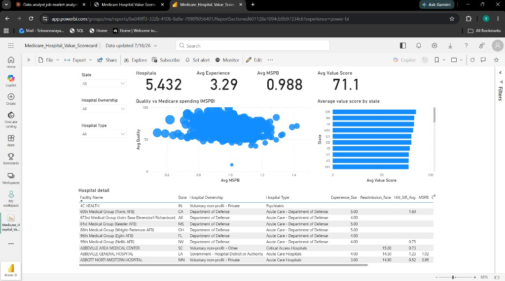

# Medicare Hospital Value Scorecard

Hospital-level look at patient experience and quality versus Medicare spending (MSPB). Built to answer a simple question: which hospitals look stronger on value, and where should a payer or health system dig in first?

Data comes from the free CMS Provider Data Catalog (Hospitals).

## Dashboard



**Live Power BI report:** [Open in Power BI Service](https://app.powerbi.com/groups/me/reports/be049ff3-332b-410b-8a9e-7998f9056401/ReportSectiond601128e1094cb9b97334c6?experience=power-bi)

Backup browser view (no Power BI login): [GitHub Pages dashboard](https://srimannarayana-ai.github.io/Medicare-Hospital-Value-Scorecard/live-dashboard/)

Desktop file:

`03_outputs/Medicare_Hospital_Value_Scorecard.pbix`

Pages:
- **Scorecard** – filters (state, ownership, hospital type), KPI cards, quality vs MSPB scatter, state bars, hospital table
- **Focus list** – 469 hospitals to review first

Quick totals on Scorecard (unfiltered): about 5,432 hospitals in the roster, ~2,338 with a value score, avg experience ~3.29, avg MSPB ~0.99, avg value ~71.

Focus list breaks down as:
- 51 high spend / low experience (MSPB > 1.10 and experience ≤ 2 stars)
- 418 low value (bottom 20% of value scores)

## Folder layout

```
Medicare Hospital Value Scorecard/
├── 01_raw/                 CMS downloads (see 01_raw/README.md)
├── 02_clean/               cleaned hospital table
├── 03_outputs/             Power BI file + summary CSVs
│   └── PowerBI/
│       └── Scorecard_Data.xlsx
├── docs/
│   ├── images/scorecard_dashboard.png
│   └── live-dashboard/     GitHub Pages interactive view
├── scripts/
├── requirements.txt
└── README.md
```

Raw CMS CSVs are not in this repo (HCAHPS alone is ~100MB). Download steps are in `01_raw/README.md`. Cleaned tables and the Power BI file are included.

## How the value score works

Short version: normalize experience / readmission / infections to 0–100, average them into Quality, then divide by MSPB.

Full write-up: `docs/value_formula.txt`

## Methodology & Design Decisions

**The question.** I wanted a single hospital-level view a payer or health system could use to spot places that cost Medicare a lot without matching patient experience or quality. The core idea is value = quality per dollar of Medicare spend.

**Why a composite score.** No single CMS file answers that. I pulled three quality signals — HCAHPS experience stars, Hybrid_HWR unplanned visits / readmission, and average HAI SIR — into one Quality score, then divided by MSPB-1. Dividing keeps it as a ratio (“quality per unit of spend”), which is easier to talk through than mixing stars, rates, and SIRs with dollars in one subtraction.

**Why equal weighting.** Quality is a simple average of whichever of those three pieces a hospital has. I used equal weights because I did not have a clinical reason to rank one higher, and equal weighting is easy to defend in an interview. The tradeoff is real: a weak infection SIR and a weak experience score count the same, which a clinician might disagree with. If I had stakeholder input later, I would revisit the weights.

**How I scaled to 0–100.** The inputs are not on the same scale. Experience is already 1–5 stars, so I used `Experience_Star / 5 * 100`. Readmission and HAI are “lower is better,” so I flipped them with a min-max across hospitals. Without that step, whichever raw measure had the wider range would dominate the average. If a hospital is missing one piece, I average the ones that are present instead of dropping the hospital from Quality.

**Hospitals without MSPB.** A large share of the CMS roster has no MSPB (common for some critical access and specialty hospitals). I kept those hospitals in the roster and left Value_Score blank, rather than deleting them. That keeps the counts honest: about 5,432 hospitals in the file, about 2,338 with a value score.

**Focus list thresholds.** Two review buckets:
- High spend / low experience: MSPB > 1.10 and experience ≤ 2 stars
- Low value: bottom 20% of Value_Score among hospitals that have a score

1.10 means at least 10% above the national MSPB benchmark (~1.0). Two stars sits in CMS’s own weak-experience range. I used those so the flags map to something a stakeholder already recognizes, not a random cutoff.

**What this is not.** This is a screening score for portfolio / analysis work, not an official CMS measure. The source measures also cover different reporting windows and populations, so the composite is for deciding where to look first — not a final ranking of every hospital in the country.

**Data vintage.** CMS Provider Data Catalog (Hospitals), files used in this project from July 2026. Measure windows in those downloads:
- MSPB: 01-01-2024 to 12/31/2024
- HCAHPS: 07/01/2024 to 06/30/2025
- Hybrid_HWR: 07/01/2023 to 06/30/2024
- HAI SIR: 07/01/2024 to 06/30/2025

CMS refreshes these files, so numbers will shift if you re-download and rebuild.

## Rebuild the data (optional)

```bash
pip install -r requirements.txt
python scripts/build_scorecard.py
python scripts/build_live_dashboard.py
```

Then open the `.pbix` and hit **Refresh**.

Keep `03_outputs/PowerBI/Scorecard_Data.xlsx` where it is — that path is what the Power BI file uses.

## Sharing

Send both files together:
1. `03_outputs/Medicare_Hospital_Value_Scorecard.pbix`
2. `03_outputs/PowerBI/Scorecard_Data.xlsx`

Or share the live link above for a quick browser view.

## Notes worth knowing

- Not every hospital has MSPB. Those stay in the roster but do not get a value score.
- Clicking a row or chart point in Power BI filters the other visuals. Click the same spot again (or empty canvas) to clear it.
- This is a project score for analysis / portfolio use, not an official CMS measure.

## Docs

| File | What it covers |
|------|----------------|
| `docs/scope.txt` | KPIs, grain, periods |
| `docs/data_dictionary.txt` | Field definitions |
| `docs/value_formula.txt` | Score math |
| `docs/images/scorecard_dashboard.png` | Scorecard screenshot |
| `docs/live-dashboard/` | Browser dashboard (GitHub Pages) |
| `docs/00_scope.xlsx` | Early scope sheet |
| `docs/01_Dictionary.xlsx` | Early dictionary sheet |
| `docs/project_notes.pdf` | Extra notes |
